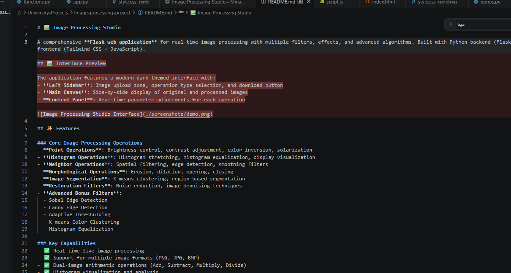
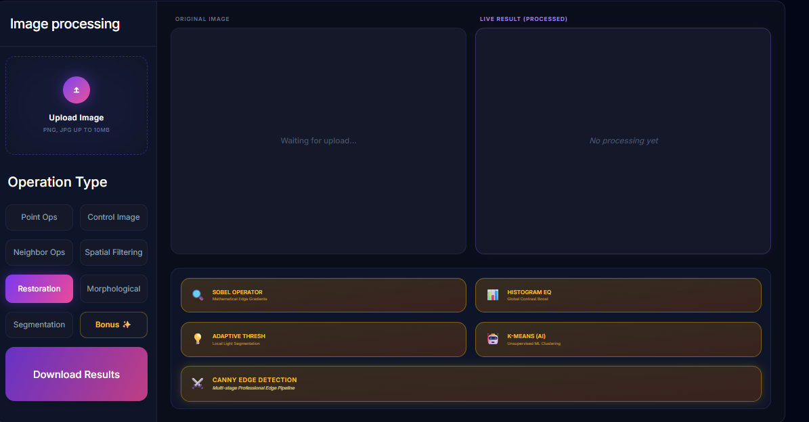
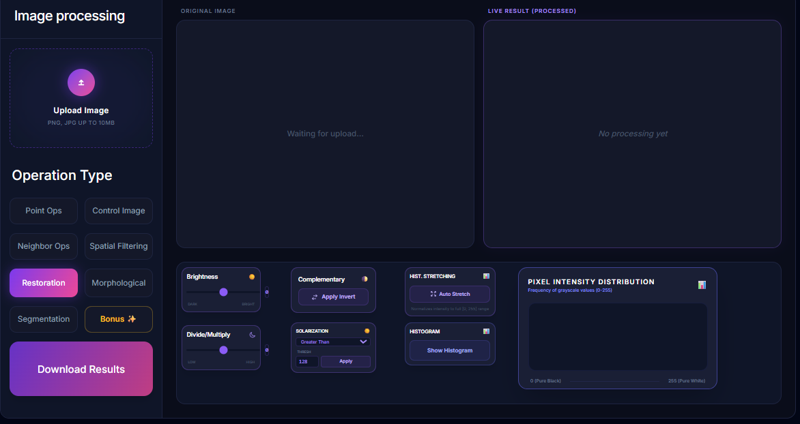

# 🖼️ Image Processing Studio

A comprehensive **Flask web application** for real-time image processing with multiple filters, effects, and advanced algorithms. Built with Python backend (Flask + OpenCV) and modern web frontend (Tailwind CSS + JavaScript).

## 🖼️ Screenshots

### Live Application Interface


### Project Presentation




## ✨ Features

### Core Image Processing Operations
- **Point Operations**: Brightness control, contrast adjustment, color inversion, solarization
- **Histogram Operations**: Histogram stretching, histogram equalization, display visualization
- **Neighbor Operations**: Spatial filtering, edge detection, smoothing filters
- **Morphological Operations**: Erosion, dilation, opening, closing
- **Image Segmentation**: K-means clustering, region-based segmentation
- **Restoration Filters**: Noise reduction, image denoising techniques
- **Advanced Bonus Filters**:
  - Sobel Edge Detection
  - Canny Edge Detection
  - Adaptive Thresholding
  - K-means Color Clustering
  - Histogram Equalization

### Key Capabilities
- ✅ Real-time live image processing
- ✅ Support for multiple image formats (PNG, JPG, BMP)
- ✅ Dual-image arithmetic operations (Add, Subtract, Multiply, Divide)
- ✅ Histogram visualization and analysis
- ✅ SNR (Signal-to-Noise Ratio) calculation
- ✅ One-click download of processed results
- ✅ Responsive web interface with dark theme
- ✅ RESTful API for image processing endpoints

## 🛠️ Tech Stack

### Backend
- **Framework**: Flask (Python web framework)
- **Image Processing**: OpenCV (cv2), NumPy, scikit-image, scikit-learn
- **Server**: Python 3.13+

### Frontend
- **UI Framework**: Tailwind CSS v3
- **Styling**: PostCSS with @apply directives
- **Interactivity**: Vanilla JavaScript (ES6+)
- **Communication**: Fetch API with base64 encoding

### Build & Development
- **Package Manager**: npm
- **CSS Processing**: PostCSS with Tailwind CLI
- **Version Control**: Git

## 📋 Requirements

```
Python 3.7+
Flask
numpy
opencv-python (cv2)
scikit-image
scikit-learn
```

## 🚀 Installation & Setup

### 1. Clone the Repository
```bash
git clone https://github.com/Mina93-min2/University-Projects.git
cd University-Projects/Image-processing-project
```

### 2. Create Virtual Environment (Recommended)
```bash
# Windows
python -m venv venv
venv\Scripts\activate

# macOS/Linux
python3 -m venv venv
source venv/bin/activate
```

### 3. Install Python Dependencies
```bash
pip install -r requirements.txt
```

Or install manually:
```bash
pip install flask
pip install numpy
pip install opencv-python
pip install scikit-image
pip install scikit-learn
```

### 4. Install Node Dependencies (Optional - for CSS development)
```bash
npm install
```

## 🎯 How to Run

### Start the Flask Application
```bash
python app.py
```

The application will be available at: **http://127.0.0.1:5000**

### Development Mode
Flask runs in debug mode by default with auto-reload enabled.

## 📖 Usage Guide

### Basic Workflow
1. **Upload Image**: Click the upload area or drag-and-drop an image
2. **Select Operation Type**: Choose from tabs (Point Ops, Control Image, Neighbor Ops, etc.)
3. **Configure Parameters**: Adjust sliders, dropdowns, and input fields
4. **View Live Results**: See processed image in real-time
5. **Download Results**: Click "Download Results" to save the processed image

### Operation Types

#### Point Operations
- **Brightness**: Adjust image brightness with slider (-100 to +100)
- **Divide/Multiply**: Scale pixel values (0.5x to 2x)
- **Complementary**: Invert colors (negative effect)
- **Solarization**: Threshold-based inversion

#### Control Image Operations
- Upload two images for arithmetic operations
- Add, Subtract, Multiply, Divide pixel values
- View results of image arithmetic

#### Neighbor Operations
- Various spatial filters and kernels
- Edge detection and smoothing
- Real-time preview

#### Spatial Filtering
- Gaussian blur, median filtering
- Bilateral filtering
- Custom kernel support

#### Restoration
- Noise reduction algorithms
- Image denoising techniques
- Quality improvement filters

#### Segmentation
- K-means clustering for color segmentation
- Region-based segmentation
- Threshold-based segmentation

#### Bonus Features ✨
- **Sobel Edge Detection**: Detect edges in images
- **Canny Edge Detection**: Advanced edge detection
- **Adaptive Thresholding**: Intelligent thresholding
- **K-means Clustering**: Color quantization and segmentation
- **Histogram Equalization**: Enhance contrast

## 📁 Project Structure

```
Image-processing-project/
├── app.py                          # Flask application (main entry point)
├── functions.py                    # Core image processing functions
├── bonus.py                        # Advanced algorithms (Sobel, Canny, K-means, etc.)
├── controller.py                   # Additional control logic
├── gui_layout.py                   # GUI layout definitions
├── test_logic.ipynb               # Test notebook for algorithm validation
├── templates/
│   └── index.html                 # Main web interface
├── static/
│   ├── js/
│   │   └── script.js              # Frontend JavaScript logic
│   ├── style.css                  # Custom styles
│   └── output.css                 # Tailwind compiled CSS
├── package.json                   # npm dependencies
├── tailwind.config.js             # Tailwind CSS configuration
├── postcss.config.js              # PostCSS configuration
├── .gitignore                     # Git ignore rules
└── README.md                      # This file
```

## 🔧 API Endpoints

The Flask backend provides these REST endpoints:

### Point Operations
- `POST /point_operation` - Apply point-based image operations
- `POST /histogram_stretch` - Auto-stretch histogram
- `POST /show_histogram` - Get histogram data

### Image Arithmetic
- `POST /control_image` - Perform arithmetic between two images

### Advanced Filters
- `POST /apply_spatial_filter` - Apply spatial filtering
- `POST /apply_bonus_filter` - Execute advanced algorithms

## 🤝 Contributing

We welcome contributions to improve the Image Processing Studio! 

### How to Contribute:
1. **Fork** the repository
2. **Create a feature branch**: `git checkout -b feature/your-feature`
3. **Make changes** and test thoroughly
4. **Commit** with clear messages: `git commit -m "Add feature description"`
5. **Push** to your fork: `git push origin feature/your-feature`
6. **Submit a Pull Request** with detailed description

### Contribution Ideas:
- Add new image processing algorithms
- Improve UI/UX design
- Optimize performance
- Add batch processing support
- Implement GPU acceleration
- Write comprehensive documentation
- Add unit tests

## 📝 License

This project is licensed under the **Apache License 2.0** - See [LICENSE](LICENSE) file for details.

### Apache License 2.0 Summary
- ✅ Commercial use allowed
- ✅ Modification allowed
- ✅ Distribution allowed
- ✅ Private use allowed
- ⚠️ License and copyright notice must be included
- ⚠️ State significant changes to the code

For full license text, visit: https://www.apache.org/licenses/LICENSE-2.0

## 👨‍💻 Author

**Mina Wagih**  
Created as a university project for Image Processing course.

## 📧 Contact & Support

- GitHub: [@Mina93-min2](https://github.com/Mina93-min2)
- Project Repository: [University-Projects](https://github.com/Mina93-min2/University-Projects)

## 🙏 Acknowledgments

- OpenCV community for computer vision tools
- Flask framework for web development
- Tailwind CSS for styling framework
- NumPy and scikit-image for scientific computing

## 📚 References

- [OpenCV Documentation](https://docs.opencv.org/)
- [Flask Documentation](https://flask.palletsprojects.com/)
- [NumPy Documentation](https://numpy.org/doc/)
- [scikit-image Documentation](https://scikit-image.org/)
- [Tailwind CSS Documentation](https://tailwindcss.com/)

---

**Last Updated**: May 2026  
**Status**: Active & Maintained ✅
